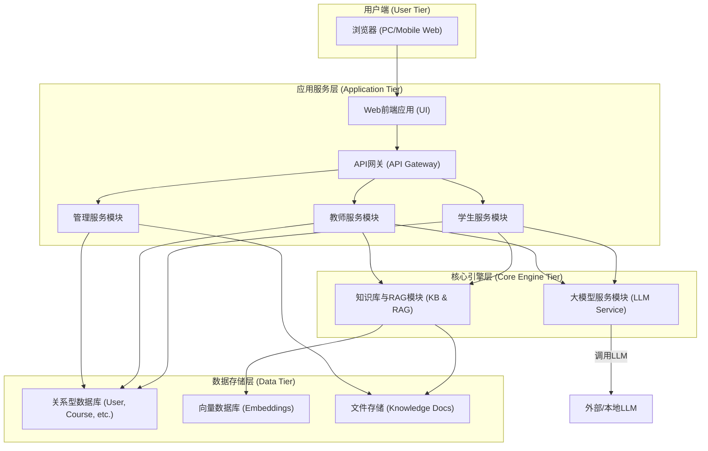
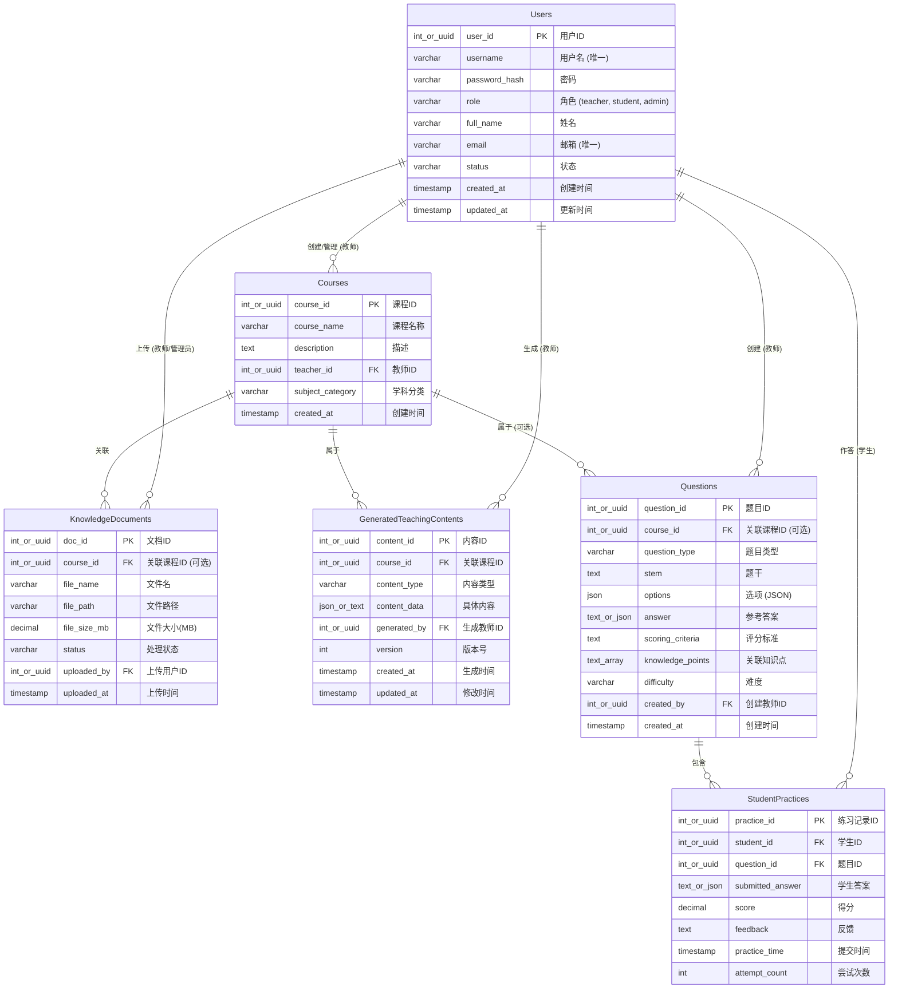

| ----------------------- | ---------------------------- | ----------------------- |
| EduNova：基于开源大模型的教学实训智能体 | 内部公开                     |                         |
| 项目编号  Project  ID   | 版本  Version                | 文档编号  Document Code |
| EDUNOVA-PROJ-001        | V1.0                         | EDUNOVA-PROJ-RA-001     |

**EduNova教学实训智能体系统需求规格说明书**

| Prepared  by   拟制   | 系统分析小组 | Date  日期 | 2024-07-27 |
| --------------------- | ------------ | ---------- | ---------- |
| Reviewed  by   评审人 | 项目负责人   | Date  日期 | 2024-07-28 |
| Approved  by  批准    | 竞赛指导教师 | Date  日期 | 2024-07-29 |

**[参赛单位名称]**

版权所有 不得复制

**目录**

[1 Introduction 简介](#1-introduction-简介)
  [1.1 Purpose 目的](#11-purpose-目的)
[2 General description 总体概述](#2-general-description-总体概述)
  [2.1 Software perspective 软件概述](#21-software-perspective-软件概述)
    [2.1.1 About the Project 项目介绍](#211-about-the-project-项目介绍)
    [2.1.2 技术架构概要](#212-技术架构概要)
  [2.2 Software function 软件功能](#22-software-function-软件功能)
  [2.3 User characteristics 用户特征](#23-user-characteristics-用户特征)
  [2.4 Constraints, Assumptions and Dependencies 约束、假设和依赖](#24-constraints-assumptions-and-dependencies-约束假设和依赖)
[3 Specific Requirements 具体需求](#3-specific-requirements-具体需求)
  [3.1 系统用例图](#31-系统用例图)
  [3.2 教师侧功能模块](#32-教师侧功能模块)
    [3.2.1 智能备课与设计功能](#321-智能备课与设计功能)
    [3.2.2 智能考核内容生成功能](#322-智能考核内容生成功能)
    [3.2.3 学情数据分析功能 (教师视图)](#323-学情数据分析功能-教师视图)
  [3.3 学生侧功能模块](#33-学生侧功能模块)
    [3.3.1 在线学习助手功能 (智能问答)](#331-在线学习助手功能-智能问答)
    [3.3.2 实时练习评测助手功能](#332-实时练习评测助手功能)
  [3.4 管理侧功能模块](#34-管理侧功能模块)
    [3.4.1 用户管理功能](#341-用户管理功能)
    [3.4.2 课件资源管理功能](#342-课件资源管理功能)
    [3.4.3 大屏概览 (Dashboard) 功能](#343-大屏概览-dashboard-功能)
  [3.5 核心引擎模块需求](#35-核心引擎模块需求)
    [3.5.1 大模型服务模块](#351-大模型服务模块)
    [3.5.2 知识库管理与检索模块 (RAG)](#352-知识库管理与检索模块-rag)
  [3.6 数据字典](#36-数据字典)
    [3.6.1 用户表 (Users)](#361-用户表-users)
    [3.6.2 课程表 (Courses)](#362-课程表-courses)
    [3.6.3 知识库文档表 (KnowledgeDocuments)](#363-知识库文档表-knowledgedocuments)
    [3.6.4 生成教学内容表 (GeneratedTeachingContents)](#364-生成教学内容表-generatedteachingcontents)
    [3.6.5 题目表 (Questions)](#365-题目表-questions)
    [3.6.6 学生练习记录表 (StudentPractices)](#366-学生练习记录表-studentpractices)
  [3.7 E-R关系图](#37-e-r关系图)
[4 Non-functional Requirements 非功能性需求](#4-non-functional-requirements-非功能性需求)
  [4.1 开源大模型核心](#41-开源大模型核心)
  [4.2 本地知识库](#42-本地知识库)
  [4.3 内容关联性与准确性](#43-内容关联性与准确性)
  [4.4 系统性能要求](#44-系统性能要求)
    [4.4.1 响应时间要求](#441-响应时间要求)
    [4.4.2 并发处理能力](#442-并发处理能力)
    [4.4.3 系统可用性](#443-系统可用性)
  [4.5 系统安全要求](#45-系统安全要求)
    [4.5.1 用户认证与授权](#451-用户认证与授权)
    [4.5.2 数据安全](#452-数据安全)
  [4.6 系统接口要求](#46-系统接口要求)
    [4.6.1 外部接口](#461-外部接口)
    [4.6.2 内部接口](#462-内部接口)
[5 Requirements Classification 需求分级](#5-requirements-classification-需求分级)

**Keywords 关键词**：
教学实训智能体、开源大模型、RAG、个性化学习、智能备课、智能问答、学情分析、教育数字化

**Abstract 摘要：**
本文档详细描述了“EduNova：基于开源大模型的教学实训智能体”系统的功能需求、非功能性需求、接口需求等。该系统旨在利用开源大模型和本地知识库增强技术，为教师提供高效的备课与考核内容生成工具，为学生提供个性化的在线学习与练习辅导，并通过数据分析优化教学过程，推动教育数字化转型。

**List of abbreviations 缩略语清单：**

| Abbreviations缩略语 | Full spelling 英文全名            | Chinese   explanation 中文解释      |
| ------------------- | --------------------------------- | ----------------------------------- |
| AI                  | Artificial Intelligence           | 人工智能                            |
| API                 | Application Programming Interface | 应用程序接口                        |
| UI                  | User Interface                    | 用户界面                            |
| DB                  | Database                          | 数据库                              |
| REST                | Representational State Transfer   | 表现层状态转换                      |
| LLM                 | Large Language Model              | 大语言模型                          |
| RAG                 | Retrieval Augmented Generation    | 检索增强生成                        |
| NLP                 | Natural Language Processing       | 自然语言处理                        |
| CRUD                | Create, Read, Update, Delete      | 增删改查                            |
| MCQ                 | Multiple Choice Question          | 选择题                              |
| SAQ                 | Short Answer Question             | 简答题                              |
| PDF                 | Portable Document Format          | 可移植文档格式                      |
| KPI                 | Key Performance Indicator         | 关键绩效指标                        |

# 1 Introduction 简介

## 1.1 Purpose 目的
本文档旨在明确“EduNova：基于开源大模型的教学实训智能体”软件的需求规格，作为项目开发、测试、验收和后续维护的主要依据。预期读者包括项目管理人员、软件开发工程师、测试工程师、最终用户代表（教师、学生、管理员）以及参与项目评估的专家。通过本文档，确保所有相关方对系统的功能和特性有一致和清晰的理解。

# 2 General description 总体概述

## 2.1 Software perspective 软件概述

### 2.1.1 About the Project 项目介绍
EduNova是一款基于开源大模型技术构建的教学实训智能体软件。它响应国家教育数字化战略，旨在解决传统实训教学在规模化与个性化方面的不足。系统通过赋能教师进行高效备课和考核设计，服务学生进行个性化练习与即时指导，从而推动大模型与实训教学的深度融合，为高素质应用型人才培养提供支持。核心技术包括自然语言处理（NLP）、大模型技术、本地知识库增强（RAG）以及自动化评估技术。

### 2.1.2 技术架构概要
系统采用模块化设计，前后端分离的架构。
1.  **前端架构**：采用现代Web技术（如React, Vue, or Angular）构建响应式用户界面，支持PC端浏览器访问。
2.  **后端架构**：采用主流后端语言及框架（Python+Flask+Vue）提供RESTful API服务。
3.  **大模型服务集成**：集成选定的开源大模型（如Llama系列、ChatGLM、Qwen、Baichuan等），通过API方式调用其文本生成、理解和推理能力。
4.  **知识库与RAG**：构建本地专业知识库，并通过Embedding和向量数据库技术实现RAG，确保生成内容的专业性和准确性。
5.  **数据库**：选用关系型数据库（SQLite)进行数据持久化存储。
6.  **部署**：支持本地化部署，确保数据安全与模型可控。

\### 2.1.3 高层系统架构图




## 2.2 Software function 软件功能
系统主要包含三大用户端的功能，并辅以核心引擎支撑：
1.  **教师端功能**：
    *   智能备课设计：基于课程大纲和知识库自动生成教学内容。
    *   智能考核题目与答案生成：自动生成多样化题目及参考答案。
    *   学情数据分析与可视化：自动化检测反馈，整体学情分析。
2.  **学生端功能**：
    *   实时学习问答辅导：基于知识库的智能问答。
    *   个性化练习与智能纠错：动态生成练习题，实时评测与指导。
    *   相关学习资源推荐。
3.  **管理与分析端功能**：
    *   学情数据综合分析与可视化（大屏概览）。
    *   用户（管理员、教师、学生）管理与权限分配。
    *   课件与教学资源管理（分类、编辑、导出）。

## 2.3 User characteristics 用户特征
系统的主要用户包括：
1.  **教师用户**：
    *   高校或职业院校从事专业实训教学的教师。
    *   期望减轻备课、出题、批改等重复性工作负担。
    *   需要工具辅助进行个性化教学和学情分析。
    *   具备基本的计算机操作能力。
2.  **学生用户**：
    *   高校或职业院校参与实训课程的学生。
    *   需要在课后获得及时的学习辅导和问题解答。
    *   期望获得个性化的练习题目和针对性的反馈。
    *   具备基本的计算机操作和学习软件使用能力。
3.  **管理员用户**：
    *   负责系统的日常运维和管理。
    *   进行用户账户管理、角色权限分配、系统参数配置。
    *   监控系统运行状态，管理教学资源库。
    *   具备一定的IT系统管理经验。

## 2.4 Constraints, Assumptions and Dependencies 约束、假设和依赖
*   **约束**：
    *   必须使用至少1个开源大模型作为核心技术组件。
    *   必须采用本地知识库，资料总量不超过100MB。
    *   生成内容必须与本地知识库高度关联且准确。
*   **假设**：
    *   用户具备基本的计算机和网络使用能力。
    *   教师能够提供结构化或半结构化的课程大纲和知识库文档。
    *   学校或机构具备部署和运行所需软件的基础硬件环境。
*   **依赖**：
    *   依赖于选定开源大模型的稳定性和性能。
    *   依赖于本地知识库资料的质量和覆盖范围。
    *   对于特定功能（如编程题自动评测），可能依赖第三方代码执行或评测沙箱环境。

# 3 Specific Requirements 具体需求

## 3.1 系统用例图

```mermaid
graph TD
    %% 定义参与者
    Teacher["教师"]
    Student["学生"]
    Admin["管理员"]

    %% 定义 EduNova 系统中的用例
    subgraph EduNova系统
        UC_Login["登录系统"]
        UC_ManageCourseDocs["管理课程资料 (上传大纲/知识库)"]
        UC_GenTeachingDesign["智能生成教学设计"]
        UC_GenAssessment["智能生成考核题目"]
        UC_ViewLearningAnalytics["查看学情分析报告"]
        UC_ManageGeneratedResources["管理生成资源"]

        UC_SmartQA["进行智能问答"]
        UC_GetPersonalizedPractice["获取个性化练习"]
        UC_SubmitPractice["提交练习并获取反馈"]
        UC_ViewResourceRecommendations["查看学习资源推荐"]

        UC_ManageUsers["管理用户账户"]
        UC_ManageRolesPermissions["管理系统角色与权限"]
        UC_ManageCourseCategories["管理课程分类"]
        UC_ViewDashboard["查看系统概览数据"]
    end

    %% 定义关系
    Teacher --> UC_Login
    Teacher --> UC_ManageCourseDocs
    Teacher --> UC_GenTeachingDesign
    Teacher --> UC_GenAssessment
    Teacher --> UC_ViewLearningAnalytics
    Teacher --> UC_ManageGeneratedResources

    Student --> UC_Login
    Student --> UC_SmartQA
    Student --> UC_GetPersonalizedPractice
    Student --> UC_SubmitPractice
    Student --> UC_ViewResourceRecommendations

    Admin --> UC_Login
    Admin --> UC_ManageUsers
    Admin --> UC_ManageRolesPermissions
    Admin --> UC_ManageCourseCategories
    Admin --> UC_ViewDashboard

```




*   **参与者**：教师、学生、管理员
*   **主要用例（教师）**：
    *   管理课程资料 (上传大纲/知识库)
    *   智能生成教学设计
    *   智能生成考核题目
    *   查看学情分析报告
    *   管理生成资源
*   **主要用例（学生）**：
    *   进行智能问答
    *   获取个性化练习
    *   提交练习并获取反馈
    *   查看学习资源推荐
*   **主要用例（管理员）**：
    *   管理用户账户
    *   管理系统角色与权限
    *   管理课程分类
    *   查看系统概览数据

## 3.2 教师侧功能模块

### 3.2.1 智能备课与设计功能
1. **功能描述**：辅助教师根据课程大纲和本地知识库文档，自动生成结构化的教学内容。

2.  **输入**：
    *   教师上传的本地课程大纲文档（如Word, PDF, TXT）。
    *   教师上传或指定的课程知识库文档/章节（如PDF, Word）。
    
3.  **处理流程**：
    *   系统解析上传的课程大纲，识别核心主题和结构。
    *   系统结合RAG技术，从本地知识库中检索与大纲章节相关的知识点和素材。
    *   调用大模型服务，根据大纲、检索到的知识和预设模板，生成以下内容：
        *   核心知识点讲解大纲与要点。
        *   实训练习任务设计（含操作步骤、预期结果）。
        *   配套的指导说明和注意事项。
        *   建议的教学环节与时间分布。
    *   允许教师对生成的内容进行预览、编辑和微调。
    
4.  **输出**：
    * 结构化的教学设计方案（可在线查看、编辑）。
    
    * 可导出为常见文档格式（如Word, PDF）。
    
    * **教师智能备课流程图**:
    
      ```mermaid
      graph TD
          A["教师上传大纲/知识库文档"] --> B{"系统处理"};
          B --> C["1. 解析文档，识别主题"];
          C --> D["2. RAG: 知识库检索相关内容"];
          D --> E["3. LLM: 生成教学内容初稿"];
          E --> F{"教师审核与编辑"};
          F -- "是" --> G["微调内容"];
          G --> H["最终教学设计方案"];
          F -- "否 (直接采纳)" --> H;
          H --> I["导出/保存教学设计"];
      ```
    
      *   *流程图示意：教师上传大纲/知识库 -> 系统解析与RAG检索 -> LLM生成教学内容初稿 -> 教师审核与编辑 -> 最终教学设计*

### 3.2.2 智能考核内容生成功能
1.  **功能描述**：根据教学内容和知识点，自动生成多样化的考核题目及参考答案与评分标准。
2.  **输入**：
    *   已确定的教学内容或指定的知识点范围。
    *   教师选择的题目类型（如选择题、填空题、简答题、编程题、案例分析题等）。
    *   教师设定的题目数量和难度（可选）。
3.  **处理流程**：
    *   系统基于输入的教学内容/知识点，结合RAG从知识库中获取相关细节。
    *   调用大模型服务，根据选定的题目类型生成题目：
        *   选择题：生成题干、正确选项、干扰选项。
        *   填空题：生成包含空缺的陈述句。
        *   简答题/案例分析题：生成问题描述和分析要求。
        *   编程题：生成题目描述、输入输出样例（具体实现可能需结合代码能力强的模型或专用工具）。
    *   同时为每道题目生成参考答案和初步的评分标准/要点。
    *   对于编程题，生成示例代码或解题思路。
    *   允许教师对生成的题目和答案进行预览、编辑和筛选。
4.  **输出**：
    *   考核题目列表（包含题干、选项等）。
    *   对应题目的参考答案和评分标准。
    *   可组卷或存入题库，支持导出。

### 3.2.3 学情数据分析功能 (教师视图)
1.  **功能描述**：对学生提交的答案进行自动化初步检测与反馈，并对班级或个体的学习数据进行统计分析。
2.  **输入**：
    *   学生提交的文本类答案或代码。
    *   班级或个体学生的整体作答数据。
3.  **处理流程**：
    *   **自动化检测与反馈**：
        *   对于文本类答案，系统可调用大模型进行语义理解，与参考答案比对，定位潜在错误点或知识点偏差。
        *   对于代码（若支持），可进行初步的静态分析或调用沙箱环境执行（高级功能）。
        *   生成初步的错误定位和修正建议。
    *   **整体学情分析**：
        *   统计学生答题的正确率、得分分布。
        *   分析知识点的掌握情况（哪些知识点正确率高/低）。
        *   识别常见错误类型和高频错误知识点。
        *   生成可视化图表（如柱状图、雷达图、趋势图）。
        *   基于分析结果，系统可生成教学效果总结和教学策略调整建议。
4.  **输出**：
    *   针对学生个别答案的初步反馈报告。
    *   班级/个体学情分析报告（含图表和文字描述）。
    *   教学建议。

## 3.3 学生侧功能模块

### 3.3.1 在线学习助手功能 (智能问答)
1.  **功能描述**：学生可随时就课程内容、实训任务、知识点理解等提出问题，智能体结合本地教学内容知识库进行准确、及时的解答。
2.  **输入**：
    *   学生通过文本输入框提出的自然语言问题。
3.  **处理流程**：
    *   系统接收学生问题，进行意图识别和关键信息提取。
    *   运用RAG技术，在本地课程知识库中检索与问题最相关的内容片段。
    *   将问题和检索到的相关知识片段组合成Prompt，提交给大模型。
    *   大模型生成针对性的回答。
    *   系统对回答进行必要的后处理（如格式化、敏感词过滤）。
4.  **输出**：
    *   在聊天界面向学生展示清晰、准确的回答。
    *   可追溯答案来源相关的知识库片段（可选）。

### 3.3.2 实时练习评测助手功能
1.  **功能描述**：系统可根据学生的学习情况动态生成练习题目，并对学生提交的练习答案进行实时评测和纠错指导。
2.  **输入**：
    *   学生提交的练习答案（文本、选择、代码等）。
    *   学生的历史练习情况、当前学习进度（可选，用于个性化出题）。
    *   学生提出的特定练习要求（如针对某知识点的练习）。
3.  **处理流程**：
    *   **个性化随练题目生成**：
        *   基于学生历史数据或特定要求，系统从题库中抽取或动态生成（调用考核内容生成逻辑）合适的练习题。
    *   **练习纠错与指导**：
        *   学生提交答案后，系统自动进行评测：
            *   客观题：直接比对答案。
            *   主观题/代码题：调用大模型或特定评测引擎，与参考答案/模型进行比对分析。
        *   实时指出答案中的错误或不足之处。
        *   提供针对性的纠错提示、解题思路引导或相关知识点链接。
4.  **输出**：
    *   练习题目。
    *   练习结果（正确/错误，得分）。
    *   详细的错误分析和改进建议。

## 3.4 管理侧功能模块

### 3.4.1 用户管理功能
1.  **功能描述**：支持管理员对系统用户（管理员、教师、学生）进行统一管理。
2.  **具体功能**：
    *   用户注册（可支持批量导入）、审批。
    *   用户登录、登出、密码修改、找回密码。
    *   用户信息（如姓名、工号/学号、所属部门/班级）的增、删、改、查。
    *   用户角色分配（管理员、教师、学生）与权限管理。
    *   用户状态管理（启用、禁用）。

### 3.4.2 课件资源管理功能
1.  **功能描述**：按学科/课程分类管理教师备课过程中产生或上传的教学设计、课件、练习题库等资源。
2.  **具体功能**：
    *   支持创建和管理学科/课程分类目录。
    *   教师可以将生成的教学设计、考核题目、上传的课件等资源归类存储。
    *   支持对已存资源进行编辑、版本管理（可选）、删除。
    *   提供资源检索功能（按名称、关键词、课程等）。
    *   支持将资源导出为常用格式（如Word, PDF, TXT）。

### 3.4.3 大屏概览 (Dashboard) 功能
1.  **功能描述**：为管理员或教学管理者提供系统整体运行情况和教学效能的可视化概览。
2.  **展示内容**：
    *   **教师使用统计**：
        *   活跃教师数量、总使用次数。
        *   各功能模块（备课、出题等）使用频率排行。
        *   可按日/周/月筛选。
    *   **学生使用统计**：
        *   活跃学生数量、总使用次数。
        *   各功能模块（问答、练习等）使用频率排行。
        *   可按日/周/月筛选。
    *   **教学效率指数**：
        *   量化展示备课与内容修正的平均耗时（与传统方式对比，需数据采集）。
        *   量化展示课后练习设计与修正的平均耗时。
        *   识别课程优化方向：例如，某学科/章节的学生练习通过率持续偏低，提示教学管理者重点关注。
    *   **学生学习效果**：
        *   学生整体的平均练习正确率趋势。
        *   可视化知识点掌握情况图谱（基于学生练习数据）。
        *   统计高频错误知识点排行。
3.  **呈现方式**：通过图表（折线图、柱状图、饼图、仪表盘等）和关键指标（KPI）进行可视化展示。

## 3.5 核心引擎模块需求

### 3.5.1 大模型服务模块
1.  **功能描述**：封装对所选开源大模型的调用，提供统一的文本生成、理解、推理服务接口。
2.  **具体需求**：
    *   支持配置和连接至少一个指定的开源大模型（如Llama系列、ChatGLM、Qwen、Baichuan等）的API。
    *   能够根据不同业务场景（备课、出题、问答、评估）构建和优化Prompt。
    *   管理与大模型的交互，包括请求发送、超时处理、响应接收与解析。
    *   提供模型输出的后处理能力（如格式化、内容安全过滤）。
    *   记录模型调用日志和性能指标。

### 3.5.2 知识库管理与检索模块 (RAG)
1. **功能描述**：负责本地专业知识库的构建、维护和高效检索，为大模型提供上下文增强。

2.  **具体需求**：
    *   **知识库文档管理**：
        *   支持教师上传多种格式（PDF, Word, TXT等）的教学资料，总量不超过100MB。
        *   对上传文档进行预处理：内容提取、清洗、按语义或固定长度切块 (Chunking)。
        
    *   **向量化与存储**：
        *   使用合适的Embedding模型将文本块转换为向量。
        *   将文本块及其向量存储在向量数据库（如FAISS, Milvus, ChromaDB等）或支持向量检索的传统数据库中，并建立索引。
        
    *   **语义检索**：
        *   接收查询文本（如学生问题、备课主题）。
        *   将查询文本向量化，并在向量数据库中执行相似度检索，返回Top-K个最相关的文本块。
        
    *   **RAG流程整合**：
        *   将检索到的相关文本块与原始查询组合成增强的Prompt，供大模型服务模块使用。
        
    * 确保检索结果与知识库内容的关联性和准确性。
    
    * **RAG流程示意图**:
    
      ```mermaid
      graph TD
          A["用户输入查询 (例如：学生问题或教师备课主题)"] --> B["1. 查询预处理与向量化"];
          B --> C["2. 在向量数据库中进行语义检索"];
          C --> D["3. 获取Top-K相关知识片段"];
          D --> E["4. 构建增强型Prompt (原始查询 + 检索到的知识片段)"];
          E --> F["5. 调用大语言模型 (LLM)"];
          F --> G["6. LLM生成响应 (答案、教学内容等)"];
          G --> H["7. 响应后处理与展示给用户"];
      ```
    
      

## 3.6 数据字典
以下为部分核心实体的数据字典示例。

### 3.6.1 用户表 (Users)
| 字段名        | 数据类型    | 可为空 | 主/外键 | 描述                       |
| ------------- | ----------- | ------ | ------- | -------------------------- |
| user_id       | INT/UUID    | 否     | PK      | 用户唯一标识               |
| username      | VARCHAR(50) | 否     | UNIQUE  | 登录用户名                 |
| password_hash | VARCHAR(255)| 否     |         | 加密后的密码               |
| role          | VARCHAR(20) | 否     |         | 用户角色 (teacher, student, admin) |
| full_name     | VARCHAR(100)| 是     |         | 用户真实姓名               |
| email         | VARCHAR(100)| 是     | UNIQUE  | 电子邮箱                   |
| status        | VARCHAR(10) | 否     |         | 状态 (active, inactive)    |
| created_at    | TIMESTAMP   | 否     |         | 创建时间                   |
| updated_at    | TIMESTAMP   | 否     |         | 最后更新时间               |

### 3.6.2 课程表 (Courses)
| 字段名        | 数据类型    | 可为空 | 主/外键 | 描述                       |
| ------------- | ----------- | ------ | ------- | -------------------------- |
| course_id     | INT/UUID    | 否     | PK      | 课程唯一标识               |
| course_name   | VARCHAR(255)| 否     |         | 课程名称                   |
| description   | TEXT        | 是     |         | 课程描述                   |
| teacher_id    | INT/UUID    | 否     | FK (Users) | 授课教师ID                 |
| subject_category| VARCHAR(100)| 是   |         | 学科分类 (如计算机、电子信息) |
| created_at    | TIMESTAMP   | 否     |         | 创建时间                   |

### 3.6.3 知识库文档表 (KnowledgeDocuments)
| 字段名        | 数据类型    | 可为空 | 主/外键 | 描述                       |
| ------------- | ----------- | ------ | ------- | -------------------------- |
| doc_id        | INT/UUID    | 否     | PK      | 文档唯一标识               |
| course_id     | INT/UUID    | 是     | FK (Courses)|关联课程ID (可选，可为通用知识) |
| file_name     | VARCHAR(255)| 否     |         | 原始文件名                 |
| file_path     | VARCHAR(512)| 否     |         | 文件存储路径               |
| file_size_mb  | DECIMAL(10,2)| 否     |         | 文件大小 (MB)              |
| status        | VARCHAR(20) | 否     |         | 处理状态 (uploaded, processing, processed, error) |
| uploaded_by   | INT/UUID    | 否     | FK (Users)| 上传用户ID                 |
| uploaded_at   | TIMESTAMP   | 否     |         | 上传时间                   |

### 3.6.4 生成教学内容表 (GeneratedTeachingContents)
| 字段名        | 数据类型    | 可为空 | 主/外键 | 描述                       |
| ------------- | ----------- | ------ | ------- | -------------------------- |
| content_id    | INT/UUID    | 否     | PK      | 内容唯一标识               |
| course_id     | INT/UUID    | 否     | FK (Courses)| 关联课程ID                 |
| content_type  | VARCHAR(50) | 否     |         | 内容类型 (e.g., '知识点大纲', '实训任务', '教学环节建议') |
| content_data  | JSON/TEXT   | 否     |         | 具体内容（结构化数据或文本） |
| generated_by  | INT/UUID    | 否     | FK (Users)| 生成操作的教师ID           |
| version       | INT         | 否     |         | 版本号 (用于编辑追溯)      |
| created_at    | TIMESTAMP   | 否     |         | 生成时间                   |
| updated_at    | TIMESTAMP   | 否     |         | 最后修改时间               |

### 3.6.5 题目表 (Questions)
| 字段名        | 数据类型    | 可为空 | 主/外键 | 描述                       |
| ------------- | ----------- | ------ | ------- | -------------------------- |
| question_id   | INT/UUID    | 否     | PK      | 题目唯一标识               |
| course_id     | INT/UUID    | 是     | FK (Courses)| 关联课程ID (若题目与特定课程绑定) |
| question_type | VARCHAR(50) | 否     |         | 题目类型 (MCQ, SAQ, Code, etc.) |
| stem          | TEXT        | 否     |         | 题干                       |
| options       | JSON        | 是     |         | 选项 (对选择题)            |
| answer        | TEXT/JSON   | 否     |         | 参考答案                   |
| scoring_criteria | TEXT     | 是     |         | 评分标准/要点              |
| knowledge_points | TEXT[]  | 是     |         |关联知识点标签 (数组)       |
| difficulty    | VARCHAR(20) | 是     |         | 难度 (easy, medium, hard)  |
| created_by    | INT/UUID    | 否     | FK (Users)| 创建教师ID                 |
| created_at    | TIMESTAMP   | 否     |         | 创建时间                   |

### 3.6.6 学生练习记录表 (StudentPractices)
| 字段名        | 数据类型    | 可为空 | 主/外键 | 描述                       |
| ------------- | ----------- | ------ | ------- | -------------------------- |
| practice_id   | INT/UUID    | 否     | PK      | 练习记录唯一标识           |
| student_id    | INT/UUID    | 否     | FK (Users)| 学生ID                     |
| question_id   | INT/UUID    | 否     | FK (Questions)| 题目ID                   |
| submitted_answer| TEXT/JSON | 否     |         | 学生提交的答案             |
| score         | DECIMAL(5,2)| 是     |         | 得分                       |
| feedback      | TEXT        | 是     |         | 系统或教师给出的反馈       |
| practice_time | TIMESTAMP   | 否     |         | 练习提交时间               |
| attempt_count | INT         | 否     | Default 1 | 尝试次数                   |

## 3.7 E-R关系图


**E-R关系图说明：**
1.  **主要实体**：用户 (Users)、角色 (Roles - 可隐含在User表或单独建表)、课程 (Courses)、知识库文档 (KnowledgeDocuments)、教学内容 (GeneratedTeachingContents)、题目 (Questions)、学生练习记录 (StudentPractices)。
2.  **核心关系**：
    *   一个`用户`可以是`教师`、`学生`或`管理员`（通过`role`字段区分）。
    *   一个`教师`可以创建和管理多个`课程`。
    *   一个`课程`可以关联多个`知识库文档`。
    *   一个`教师`可以为一个`课程`生成多个`教学内容`。
    *   一个`教师`可以创建多个`题目`，题目可以与`课程`或特定`知识点`关联。
    *   一个`学生`可以参与多个`课程`的`练习`。
    *   一个`学生练习记录`关联一个`学生`和一个`题目`，记录其作答情况。
    *   `管理员`管理`用户`信息。

# 4 Non-functional Requirements 非功能性需求

## 4.1 开源大模型核心
系统必须明确使用至少1个开源大模型（如Llama系列、ChatGLM、Qwen、Baichuan等）作为其核心的智能处理组件，用于文本生成、理解、问答和评估等功能。应优先选择对中文优化良好或国产的开源大模型。

## 4.2 本地知识库
系统必须采用本地知识库作为大模型回答和内容生成的主要依据。
*   知识库资料由参赛队伍自行准备与某一专业相关的教学资料，或使用官方提供的《嵌入式Linux开发实践教程》部分课件资料。
*   本地知识库资料总量不得大于100MB。
*   系统需提供知识库文档的上传、管理和处理功能，以构建用于RAG的向量数据库。

## 4.3 内容关联性与准确性
*   所有由大模型生成的内容（包括教学设计、知识讲解、练习题目及其答案等）必须与本地知识库内容高度关联。
*   生成的内容必须保持专业上的准确性，避免产生误导性信息。
*   在演示或文档中，需清晰说明和验证抽取的知识点、基于该知识点设计的题目、题目与知识点的关联性以及答案的准确性。例如，能够回溯答案或题目生成的知识来源。

## 4.4 系统性能要求

### 4.4.1 响应时间要求
*   **常规页面加载时间**：核心页面（如教师备课界面、学生练习界面）在良好网络环境下应在3秒内完成加载。
*   **大模型交互响应时间**：
    *   简单问答响应时间：平均应在5秒以内。
    *   复杂内容生成（如教学大纲、多题目生成）：平均应在15-30秒以内，并提供进度提示。
*   **数据查询与分析操作响应时间**：常规数据查询应在2秒内返回结果，复杂学情分析报告生成应在10秒内。

### 4.4.2 并发处理能力
*   系统应能支持至少50个并发用户（混合教师和学生角色）的常规操作。
*   大模型推理服务的并发能力取决于所选模型的部署方式和硬件资源，应能满足典型教学场景下的并发需求（如一个班级学生同时进行练习）。

### 4.4.3 系统可用性
*   系统应保证7x24小时可用（除计划内维护时间）。
*   年可用性目标：不低于99.5%。
*   系统应具备基本的数据备份与恢复机制，确保用户数据的安全。

## 4.5 系统安全要求

### 4.5.1 用户认证与授权
*   **用户认证**：
    *   所有用户必须通过身份验证（如用户名密码）后方可访问系统。
    *   密码应加密存储，防止明文泄露。
    *   应有登录失败次数限制和账户锁定机制。
*   **权限控制**：
    *   采用基于角色的访问控制（RBAC）。
    *   不同角色的用户（管理员、教师、学生）拥有不同的操作权限，确保数据隔离和操作安全。
    *   教师只能管理自己创建或授权的课程资源。学生只能访问授权课程和个人学习数据。

### 4.5.2 数据安全
*   **数据传输安全**：敏感数据（如用户凭证、个人信息）在传输过程中应使用HTTPS等加密协议。
*   **数据存储安全**：重要的敏感数据在存储时应考虑加密。
*   **知识库安全**：确保上传的本地知识库资料不被未授权访问。
*   **防注入攻击**：对用户输入进行有效验证和过滤，防止SQL注入、XSS等常见Web攻击。
*   **操作日志**：关键操作（如登录、重要数据修改、资源上传下载）应有日志记录，便于审计和问题追踪。

## 4.6 系统接口要求

### 4.6.1 外部接口
*   **开源大模型API接口**：系统需能通过API调用本地部署或云端托管的开源大模型服务。接口需支持文本输入、参数配置（如temperature, max_tokens）和结构化输出的接收。
*   **(可选) 教务系统接口**：未来可考虑与学校现有教务系统对接，实现用户身份同步、课程信息导入等功能。

### 4.6.2 内部接口
*   **模块间接口**：系统内部各模块之间应通过定义良好的API（如RESTful API）进行通信，确保模块的独立性和可维护性。
*   **前端与后端接口**：前后端分离架构，通过JSON格式的RESTful API进行数据交互。接口设计应遵循标准规范，包含版本管理、统一的错误处理和状态码。

# 5 Requirements Classification 需求分级
依据功能对项目目标贡献的核心程度及实现优先级，将需求分为三级：A（必须实现的核心功能）、B（重要功能，显著提升实用性）、C（可选的增强功能）。

| Requirement ID | Requirement Name                      | User Role(s)   | Classification | 备注                                   |
|----------------|---------------------------------------|----------------|----------------|----------------------------------------|
| **教师侧**     |                                       |                |                |                                        |
| REQ-T01        | 教学内容自动设计 (基于大纲与知识库)     | 教师           | A              | 核心备课功能                           |
| REQ-T02        | 多样化考核题目与答案自动生成          | 教师           | A              | 核心出题功能                           |
| REQ-T03        | 自动化初步检测与反馈 (文本类)         | 教师           | B              | 提升批改效率，学情分析基础             |
| REQ-T04        | 整体学情分析与可视化 (知识点掌握等)   | 教师           | A              | 教学改进依据                           |
| **学生侧**     |                                       |                |                |                                        |
| REQ-S01        | 智能问答 (基于本地知识库)             | 学生           | A              | 核心辅导功能                           |
| REQ-S02        | 个性化随练题目生成                    | 学生           | A              | 实现因材施教                           |
| REQ-S03        | 练习实时评测与纠错指导                | 学生           | A              | 即时反馈，提升学习效果                 |
| REQ-S04        | 相关学习资源推荐                      | 学生           | B              | 扩展学习路径                           |
| **管理侧**     |                                       |                |                |                                        |
| REQ-M01        | 用户管理 (角色、权限、信息)           | 管理员         | A              | 系统基础功能                           |
| REQ-M02        | 课件资源管理 (分类、编辑、导出)       | 教师、管理员   | B              | 教学资源积累与复用                     |
| REQ-M03        | 大屏概览 (使用统计、效率指数、学习效果) | 管理员、教师   | B              | 系统价值体现与决策支持                 |
| **核心技术**   |                                       |                |                |                                        |
| REQ-NF01       | 集成并使用指定开源大模型              | 开发团队       | A              | 赛题强制要求                           |
| REQ-NF02       | 构建并应用本地知识库 (RAG)            | 开发团队       | A              | 赛题强制要求，保证内容质量             |
| REQ-NF03       | 保证生成内容与知识库的关联性和准确性  | 开发团队       | A              | 核心质量要求                           |